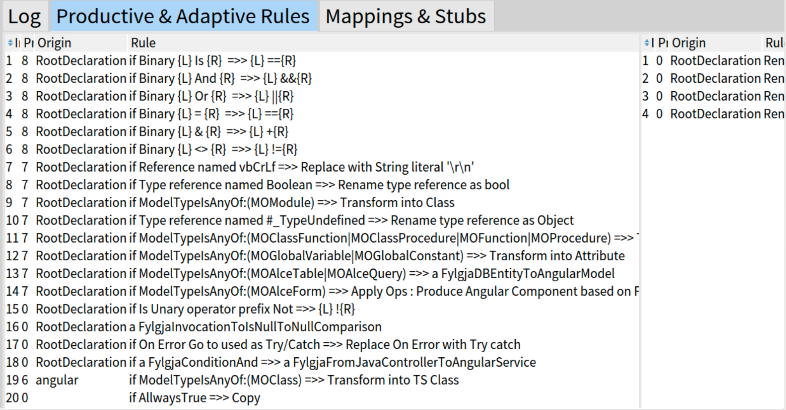

# Fylgja - GUI

The tool is split in two areas: migrating tool and feedback. 

## Migrating tool: 

The figure depicts the central area of the migrating tool. 

- Toolbar: tools for the project.
- The left panel shows the structure and code of the MS Access project.
- The right-top panel shows the structure and code of the Java-SpringBoot project.
- The right-top panel shows the structure and code of the TypeScript-Angular project.

## Feedback area: 

In the bottom part of the tool we find three tabs.

1- Log 
This tab shows logs of the actions applied, informing errors and successes.

2- Rules 
Shows the rules valid in a selected context (a class by example)

3- Mappings
Shows the mappings and stubs tracked so far and valid in a given context.

## Using the tool.
The user can drag and drop a Declaration from one model to another. Once the drop is done, a popup asks the user to tell which directive she wants to apply: map or produce. In implementing the approach, we decided to allow the user to have different levels of control over the lookup of rules when applying the produce directive. 
(i) automatic lookup: the lookup uses the first found result. 
(ii) multiple choice: the lookup prompts the user to choose the rule to be applied. 
(iii) debugging: the lookup prompts the user to choose each rule.
In both (ii) and (iii) cases, the user chooses from all the rules available in the scope with positive conditions.

In the following images we find the GUI prompting the user to choose the rule to be applied in two different cases:
.
.

## API 

### FylgjaApplication
I am a spec application. I create new UI terminals.

#### Properties
backend
windows
properties
configuration
iconManager
iconProvider
controller

#### Methods
##### FylgjaApplication>>migratorSingleDestinationUi
Create a single destination UI. (for two models)

##### FylgjaApplication>>migratorUi
Create a two destination UI. (for three models)

### FylgjaMigrationUIController
I handle the migrating "session" orchestrating one or more UI. 

#### Properties
fylgja
origin
destinations
interestedInSelection
interestedInLogging
lookupContext
projectName

#### Methods
##### FylgjaMigrationUIController>>applyCommand: aCommand informing: aWidget do: aBlock
Apply a transactionally a command. I notify the given widget when succeed. I log when error

##### FylgjaMigrationUIController>>createCheckpointFor: aWidget
Create checkpoint. For doing that I create a new derivative model and push it in the stack of models

##### FylgjaMigrationUIController>>doOrLog: aFullBlockClosure forOperation: aOperationName ifFailReturn: aBlock
Execute a given block. If if fail, i log and execute the fail block.

##### FylgjaMigrationUIController>>transactionalDoOrLog: aFullBlockClosure forOperation: aOperationName ifFailReturn: aBlock
I create a checkpoint. Execute a given block. If if fail, i log and execute the fail block and after I rollback changes.

##### FylgjaMigrationUIController>>dropAllChangesWith: aWidget
Undo all the changes done since the begining

##### FylgjaMigrationUIController>>exportDraft: aFileReference informTo: aWidget
Export a draft of the project

### MoxingTextComposer
I am a text composer, in charge of stylish text.

#### Properties
ast
text
model
style

#### Methods
##### MoxingTextComposer>>compose: anAst model: aModel style: aStyle into: aText browsingWith: aBrowsingObject 
I compose a given text content based on a AST. Applying highlight and theme according to each language. 

##### MoxingTextComposer>>compose: aString parser: aParser model: aModel style: aStyle browsingWith: aBrowsingObject
I create a Text and compose it according to the language. I require a parser to work. 

